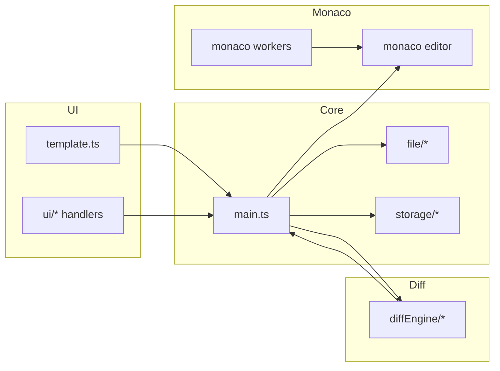

# 01. 全体像（Overview）

この章で理解できること
- diff-viewer が「単体HTMLで差分表示」を実現する全体構成
- 主要モジュールの役割とつながり
- 入口ファイルと読み始めるべき順序

## 全体像
このリポジトリは「左右2ペインに Monaco Editor を配置し、自前の差分ロジックで装飾表示する」構成です。
起点は `src/main.ts` で、UI生成・差分計算・イベント配線・保存復元の統合を行います。

### 主要ディレクトリ
- `src/main.ts`: 起動・初期化・イベント配線・差分再計算の中心
- `src/ui/`: UI構造とイベントハンドラ（template/パネル/トグル/ショートカット）
- `src/diffEngine/`: 差分の純粋ロジック（UIに依存しない）
- `src/file/`: ファイル読み込み・連結・行番号管理
- `src/storage/`: localStorage への保存/復元
- `src/monaco/`: Monaco の worker と言語登録
- `src/scrollSync/`: スクロール同期の制御

## アーキテクチャ図

## TypeScript 初心者向けポイント
- **型注釈**: `const x: number = 1` のように型を明示する
- **union型**: `"left" | "right"` のように取り得る値を限定する
- **interface/type**: データ構造を表す（`src/storage/workspaces.ts` に例が多い）

初心者が詰まりがちなポイント
- `null` と `undefined` の違い（`value: string | null` などが頻出）
- `as` による型の断定（MonacoのAPIでよく使う）

次に読む: `text/02_entry_and_boot.md`
