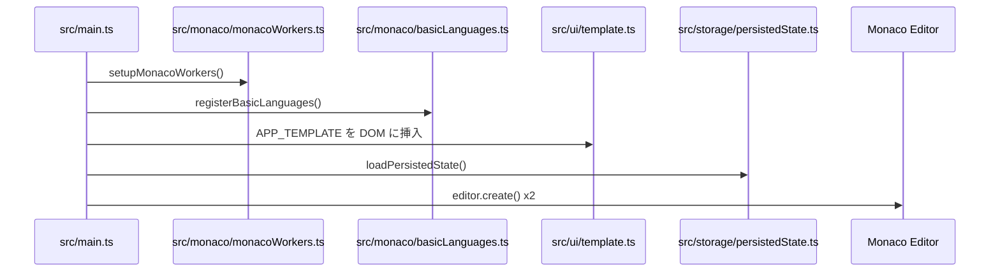

# 02. 起動〜初期化の流れ（Entry & Boot）

この章で理解できること
- どのファイルが起点か
- 起動時にどんな初期化が行われるか
- TypeScriptの型と初期化パターン

## 起点ファイル
- エントリポイントは `src/main.ts`
- Monacoの準備は `src/monaco/monacoWorkers.ts` と `src/monaco/basicLanguages.ts`
- UIテンプレートは `src/ui/template.ts` の `APP_TEMPLATE`

## 起動フロー（概要）
1. Monaco worker の設定と基本言語の登録
2. `APP_TEMPLATE` を DOM に流し込む
3. localStorage から状態を読み込む
4. Monaco editor を左右に生成
5. UIイベントやショートカットの配線
6. 初回の差分再計算（安定化フロー）

## 起動フロー図

## TypeScript 初心者向けポイント
- **関数の戻り値型**: `function foo(): void` のように返り値を明示する
- **型エイリアス**: `type Foo = { ... }` で構造を定義する
- **optional**: `value?: string` は「無いかもしれない」値

初心者が詰まりがちなポイント
- `document.querySelector` の戻り値は `HTMLElement | null` なので、`?` や `if` でガードが必要
- Monaco の型は `monaco.editor.IStandaloneCodeEditor` など長いが、型が分かると読みやすい

次に読む: `text/03_ui_architecture.md`
