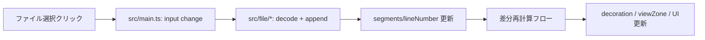

# 03. UI構造とイベント（UI Architecture）

この章で理解できること
- UIがどのファイルに集約されているか
- イベントやショートカットの配線の考え方
- UI側とロジック側の分離のしかた

## UI構造の中心
- UIテンプレートは `src/ui/template.ts` の `APP_TEMPLATE` に集約
- 画面の主要領域:
  - ツールバー（差分再計算、トグル類）
  - ワークスペースUI
  - アンカーパネル
  - 左右ペイン

## UIイベントの配線
`src/main.ts` で次のようなイベントを配線しています。
- クリック（例: 差分再計算ボタン）
- ショートカット（例: Alt+N/Alt+T/Alt+H）
- パネル開閉（ワークスペース/パス登録）

UIの振る舞いは `src/ui/` の小さなモジュールで分割されています。
例:
- `src/ui/workspacePanel.ts`: ワークスペースパネルの開閉
- `src/ui/favoritePanel.ts`: パス登録UIの開閉
- `src/ui/wordWrapShortcut.ts`: Alt+Z のショートカット

## 代表的なイベントフロー
ファイル選択→読み込み→差分再計算の流れを整理します。

## TypeScript 初心者向けポイント
- **イベントハンドラの型**: `Event` や `KeyboardEvent` の型が付いている
- **ユーティリティ分割**: `src/ui/` の関数は UI責務を限定している

初心者が詰まりがちなポイント
- `event.target` は `EventTarget` 型であり、`as HTMLInputElement` が必要
- ボタンや入力は `HTMLElement | null` なので nullチェックが必須

次に読む: `text/04_diff_pipeline.md`
